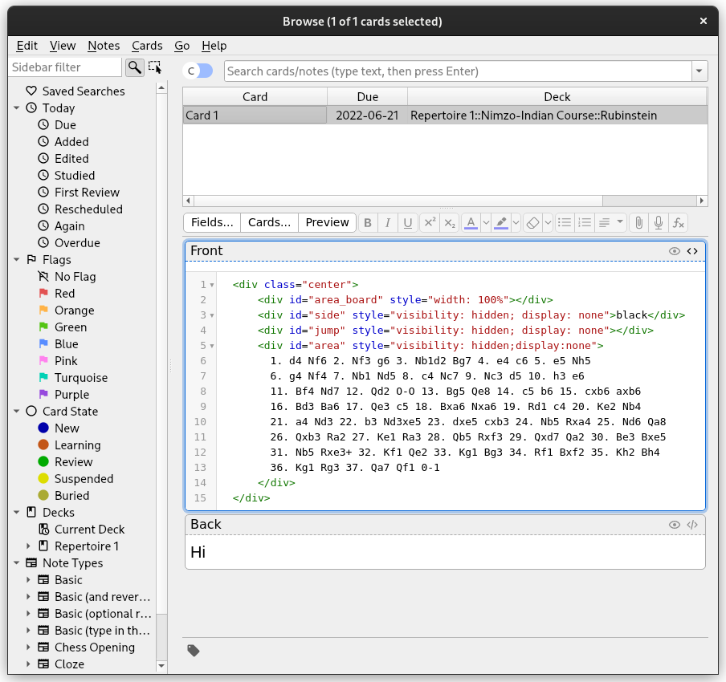
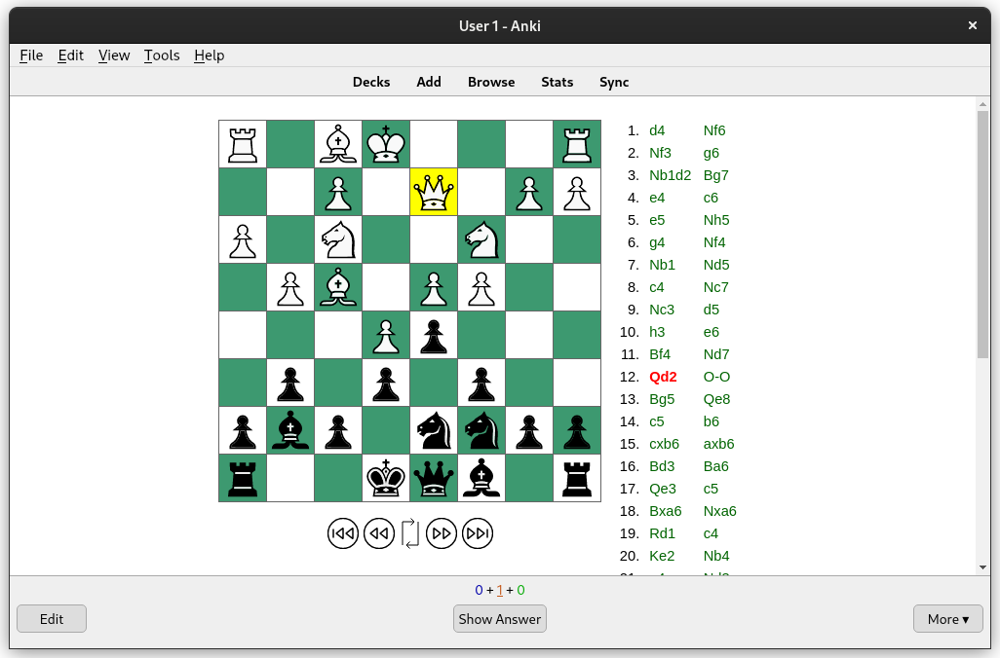
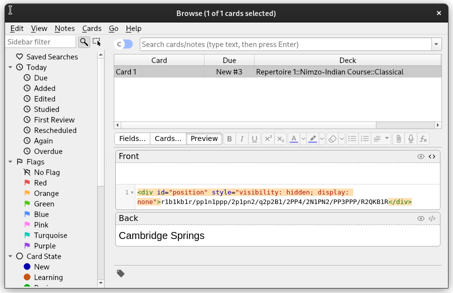
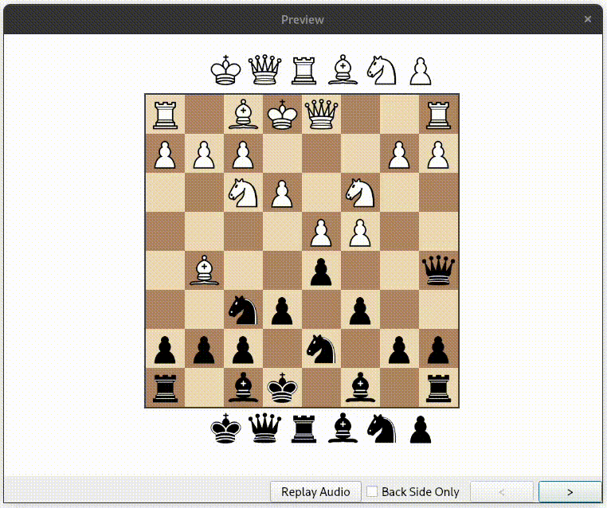
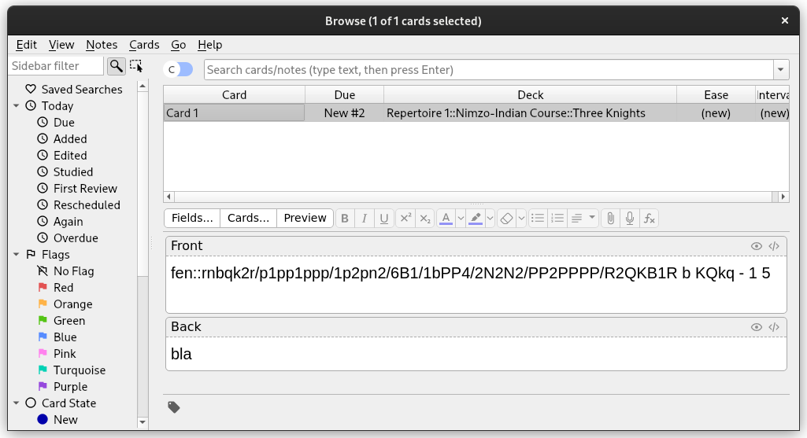
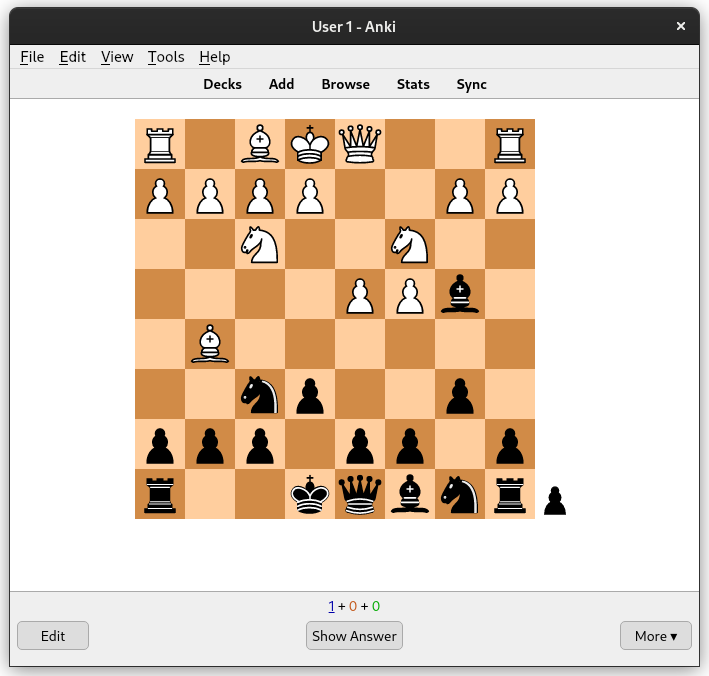

# Ankichess

This repo contains a number of **hacks** for working with chess FEN diagrams and PGN
files in Anki.
It contains:
- an explanation of how to get a PGN viewer working in Anki
- how to get a board with pieces that can be moved around
- an Anki addon called *ankichess* that converts a tagged fen string into an image

Last "tested" on Anki version 2.1.53.

## PGN Viewer in Anki
The PGN viewer used is based on [JS PGN Viewer](https://toomasr.github.io/jspgnviewer/).
The "prototype" system for our PGN viewer is located in the directory _pgnviewer_.
The javascript file "\_chess.js" is a concatenation of the files "\_board.js", 
"\_pgn.js" and "\_converter.js".

Optional "arguments":
- In div with id="jump": specify a _ply_ to jump to initially. The default is to jump to
the last position
- In div with id="side": flips the board if the div contains the text "black" as shown in 
the screenshot

Keyboard shortcuts:
- 'j': move forward (down)
- 'k': move backward (up)

### Screenshots



### Installation
1. Copy the folders *js* and *img* from _pgnviewer_ into collection.media
2. Create a new note type, e.g. Chess Openings
3. Modify the front template:

```javascript
{{Front}}

<script src='js/_chess.js'></script>
<script>
    var game;
    var conv;
    var brd;

    function init() {
      game = new Pgn(document.getElementById('area').innerHTML);
      conv = new Converter(game);
      conv.convert();
      brd = new Board('area', { 'root': './' });
      brd.init();
      window.onload = function () {
        document.getElementById("area_board_moves").focus();
      };
    }

    function waitForElm(selector) {
        return new Promise(resolve => {
            if (document.querySelector(selector)) {
                return resolve(document.querySelector(selector));
            }

            const observer = new MutationObserver(mutations => {
                if (document.querySelector(selector)) {
                    resolve(document.querySelector(selector));
                    observer.disconnect();
                }
            });

            observer.observe(document.body, {
                childList: true,
                subtree: true
            });
        });
    }

    waitForElm('#area').then((elm) => {
        console.log('Element is ready');
        console.log(elm.textContent);
        init();
    });
</script>
```

4. Add to the Styling section:
```css
*:focus {
  outline: none;
}

tr[name='buttons'] {
  height: 60px;
}

.center {
    margin: auto;
    width: 60%;
}

num {
   width: 30px;
   text-align: right;
   font-size: 11pt;
   font-family: "Helvetica Neue", Helvetica, Arial, sans-serif;
   color: black;
   display: inline-block;
   margin-right: 10px;
}

.move {
   color: darkgreen;
   text-align: left;
   width: 50px;
   font-size: 11pt;
   font-family: "Helvetica Neue", Helvetica, Arial, sans-serif;
   text-decoration: none;
   display: inline-block;
   white-space: nowrap;
}
```
5. Test by creating a card of the type and front matter:
```html
  <div class="center">
      <div id="area_board" style="width: 100%"></div>
      <div id="side" style="visibility: hidden; display: none">black</div>
      <div id="jump" style="visibility: hidden; display: none"></div>
      <div id="area" style="visibility: hidden;display:none">
        1. d4 Nf6 2. Nf3 g6 3. Nb1d2 Bg7 4. e4 c6 5. e5 Nh5
        6. g4 Nf4 7. Nb1 Nd5 8. c4 Nc7 9. Nc3 d5 10. h3 e6
        11. Bf4 Nd7 12. Qd2 O-O 13. Bg5 Qe8 14. c5 b6 15. cxb6 axb6
        16. Bd3 Ba6 17. Qe3 c5 18. Bxa6 Nxa6 19. Rd1 c4 20. Ke2 Nb4
        21. a4 Nd3 22. b3 Nd3xe5 23. dxe5 cxb3 24. Nb5 Rxa4 25. Nd6 Qa8
        26. Qxb3 Ra2 27. Ke1 Ra3 28. Qb5 Rxf3 29. Qxd7 Qa2 30. Be3 Bxe5
        31. Nb5 Rxe3+ 32. Kf1 Qe2 33. Kg1 Bg3 34. Rf1 Bxf2 35. Kh2 Bh4
        36. Kg1 Rg3 37. Qa7 Qf1 0-1
      </div>
  </div>
```

## Interactive Board

This hack uses the [chessboard.js](https://chessboardjs.com/) library to get an
interactive board with spare pieces. Chess rules are not enforced.

### Screenshots



### Installation
Similar to getting pgn viewer working. Bit simpler.

1. Copy the contents of chessboard.js folder to collection.media
2. Create a new note type
3. Front tempate:
```javascript
{{Front}}

<div id="orientation" style="visibility: hidden; display: none">black</div>
<div id="spare" style="visibility: hidden; display: none">true</div>
<div id="myBoard" style="width: 400px"></div>
<script src="js/jquery-3.6.0.min.js"></script>
<script src="js/chessboard-1.0.0.js"></script>
<script>
var board = Chessboard('myBoard', {
  position: document.getElementById("position").innerText,
  showNotation: false,
  draggable: true,
  orientation: document.getElementById("orientation").innerText,
  dropOffBoard: 'trash',
  sparePieces: document.getElementById("spare").innerText == 'true'
})
</script>
```
4. Styling
```css
.card {
    font-family: arial;
    font-size: 20px;
    text-align: center;
    color: black;
    background-color: white;
}

#myBoard {
  display: inline-block;
}

.clearfix-7da63 {
  clear: both;
}

.board-b72b1 {
  border: 2px solid #404040;
  box-sizing: content-box;
}

.square-55d63 {
  float: left;
  position: relative;

  /* disable any native browser highlighting */
  -webkit-touch-callout: none;
    -webkit-user-select: none;
     -khtml-user-select: none;
       -moz-user-select: none;
        -ms-user-select: none;
            user-select: none;
}

.white-1e1d7 {
  background-color: #f0d9b5;
  color: #b58863;
}

.black-3c85d {
  background-color: #b58863;
  color: #f0d9b5;
}

.highlight1-32417, .highlight2-9c5d2 {
  box-shadow: inset 0 0 3px 3px yellow;
}

.notation-322f9 {
  cursor: default;
  font-family: "Helvetica Neue", Helvetica, Arial, sans-serif;
  font-size: 14px;
  position: absolute;
}

.alpha-d2270 {
  bottom: 1px;
  right: 3px;
}

.numeric-fc462 {
  top: 2px;
  left: 2px;
}
```
## Addons
Add-ons for Anki 2.1+ to support learning chess using Anki.  
There is only one add-on at the moment, namely **replace_fen_with_svg**.
The addon depends on the following non-standard packages:
- `chess` : bundled with this addon.  


No unit testing has been done.  
A handful of runs have been done using Anki desktop on Ubuntu 20.04.

### Screenshots



### replace_fen_with_svg

Replaces a Forsyth–Edwards Notation (FEN) of a chess position
with an SVG. The FEN string starts with `fen::` and ends with newline 
or `<br>`.

There are a few options to configure the svg output.
These options are documented [here.](config.md)

### Installation

Create a folder `ankichess` in the Anki addons folder and
copy the contents of this folder there.
Symbolic linking from the Anki addons folder to another
location does not work at time of writing (Anki v2.1.53).
Update: Symbolic linking does not work when Anki is sandboxed in a flatpak.
